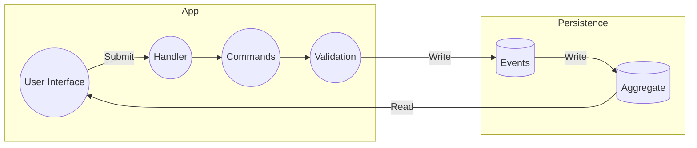
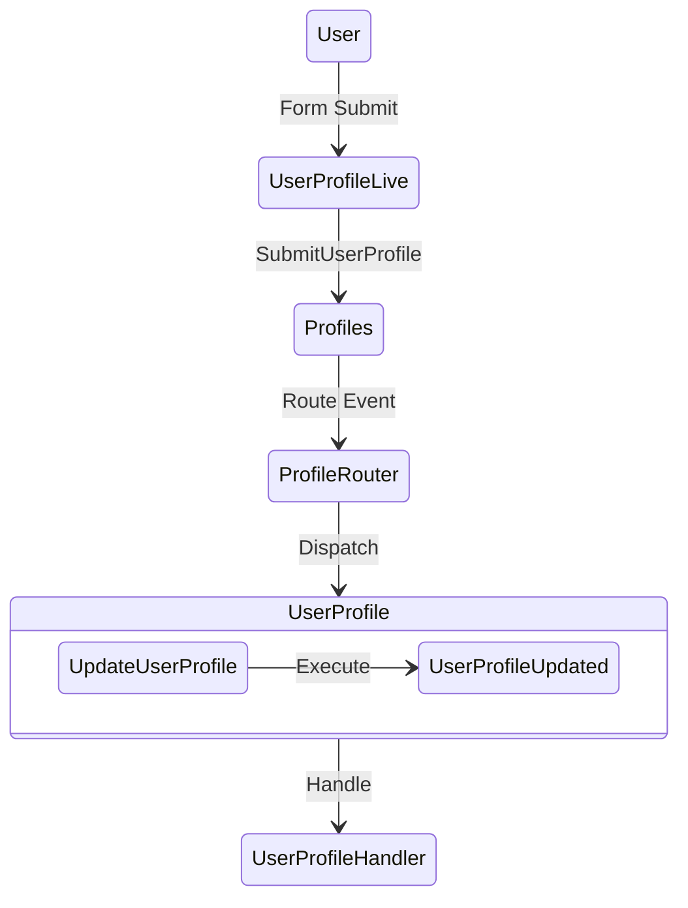

# 🤓 Event Sourcing for Newbz

- [🤓 Event Sourcing for Newbz](#-event-sourcing-for-newbz)
  - [Overview](#overview)
    - [🎬 Enter Event Sourcing](#-enter-event-sourcing)
  - [Benefits](#benefits)
  - [📓 Terminology](#-terminology)
  - [🍱 CQRS: Command Query Responsibility Segregation](#-cqrs-command-query-responsibility-segregation)
  - [User Profile Example](#user-profile-example)

## Overview

> Written by an event sourcing newb.

Software applications are responsible for managing data changes over time.

In traditional CRUD (create, read, update, delete) applications, the most common pattern is to write code that updates values in a database. When a user changes their email address, the existing value in the database is overwritten with the new value. This is true for most or all pieces of data in applications.

While this mental model has worked well enough over the decades, there are often scenarios which highlight the limitations of CRUD.

A common and easy-to-understand exception would be financial accounts. Sure, an account's balance can be represented in CRUD terms, where an account is created with an initial balance, the balance is read and updated over time, and the account may even be deleted. However, critical information and context is lost with this approach. For example, what if one of the updates was the result of a mistake or fraud? What if the customer and business need to know the history of an account?

Some of this historical information can be gleaned from database logs, but in practice this tends to be more painful than it seems for reasons out of scope for this document.

### 🎬 Enter Event Sourcing

When historical context is valuable to a business and its customers, Event Eourcing (ES) provides an alternative mental model for storing and retrieving data.

The benefits extend beyond the example of financial accounting. Think of documentation which is maintained over a long period of time, perhaps several years. Often, it is helpful to understand how a document has changed before arriving at its current state. It may be useful to know who made a change, when it happened, and how the change affected the document.

Without a persistent history of changes, this important context is lost.

Other examples might include a code repository (a la git version control), user password changes (to prevent reuse), medical records, education records, and the list goes on.

With the concept of Event Sourcing, the application is built using a pattern which handles traditional CRUD operations a bit differently. Where the create, update, and delete actions in CRUD would overwrite one or more values in a database, ES appends each of these actions to an event stream, where each event is immutable.

Read operations (`get`, `like`) are performed on a separate database, where past events have been distilled (or aggregated) into a current state. These aggregated values are built using the entire history from the event stream. Because event streams tend to grow rapidly, and may take a long time to rebuild into aggregates, event sourcing tools use **snapshots** to persist aggregate values on a cadence (10 seconds, for example). This way, when a system restarts or recovers from an outage, aggregate values can be restored from a previous snapshot, and only the events since that snapshot need to be factored into the aggregate.

> For event sourced data, the application writes to an event stream and reads from an aggregate data store.

Event subscriptions allow components within the system to respond to changes in various ways. For example, in a Phoenix LiveView application, a user profile update event may be codified as an `%UpdateUserProfile{}` struct which contains keys for `:user_profile_id`, `:updated_by`, and other relevant data. A router will be configured to listen for these events, dispatching them to the appropriate aggregate(s).

The primary aggregate may be the event store for user profile events, and another aggregate may be Phoenix PubSub. PubSub would allow other Elixir processes to subscribe and handle event messages when they happen. So, the update event could be dispatched to both the event store and a LiveView concurrently; the new values would be rendered to the user interface while the event system stores the event and updates the aggregate database.

## Benefits

- Simplified access control
- Independent performance tuning on write and read repos
- No contention during concurrent updates on the same record

## 📓 Terminology

So far, you have likely seen words which may be unfamiliar and confusing. Event sourcing concepts and tooling introduce a set of terms uncommon in CRUD application.

The table below lists ES terms, synonyms which may be more familiar, and brief descriptions:

| ES Term   | Synonyms                                              | Description                                                                    | Tense   |
| --------- | ----------------------------------------------------- | ------------------------------------------------------------------------------ | ------- |
| Event     | Action, Verb                                          | Activity which must be persisted.                                              | Past    |
| Aggregate | Noun, Current State, Calculated/Derived/Merged Values | A model or schema representing the current state derived from an event stream. | N/A     |
| Command   | Request, Create, Update, Delete                       | An instruction to the application that an event has happened.                  | Present |
| Query     | Read, List                                            |                                                                                | N/A     |
| Metadata  |                                                       |                                                                                | N/A     |

With event sourcing, it's important to think about grammar. Nouns, verbs, and tenses are used to codify events happening in an application.

- A command is represented as a present tense verb and a noun, ie `CreateSubscription`.
- An event successfully generated from a command is represented as a noun followed by a past tense verb, ie `SubscriptionCreated`.

## 🍱 CQRS: Command Query Responsibility Segregation

So far, you've seen new concepts and terms focussed on event sourcing. There is a complimentary concept called Command Query Responsibility Segregation (CQRS), which further distinguishes between **writing** and **reading** data.

The following diagram illustrates the lifecycle of an event triggered by a user interface:

In this example, event data is stored in a separate database from aggregate data. However, this is not a strict requirement. Event table may live alongside aggregate tables in the same database, but writes should only be executed on the event tables and reads should only be queried against the aggregate tables. Within a single database roles and schemas/prefixes may help enforce this boundary.

## User Profile Example

> ⚠️ This diagram is a WIP, and not yet accurate.

